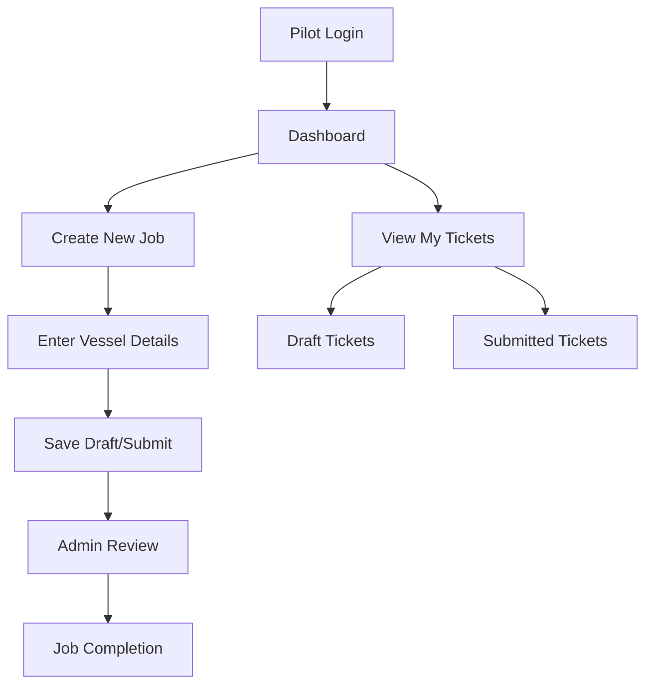

# Maritime Pilotage Ticketing & Workflow Management System

##  Project Overview

A comprehensive digital solution for maritime pilotage operations, replacing traditional paper-based ticketing systems with an automated workflow management platform. This system streamlines the entire pilotage process from job creation to completion tracking.

##  Key Features

### User Management & Authentication
- Role-based access control (Pilots, Administrators)
- Secure login system with credential validation
- User profile management

### Pilot Operations
- **Job Creation**: Digital ticket generation with vessel details
- **Draft Management**: Save and resume incomplete tickets
- **Submission Workflow**: Multi-step validation and approval process
- **Job Tracking**: Real-time status monitoring of submitted tickets

### Administrative Functions
- **Ticket Review**: Centralized pending ticket management
- **User Administration**: Pilot and staff account management
- **Vessel Database**: Comprehensive vessel information system
- **System Configuration**: Customizable settings and parameters

### Data Management
- **Vessel Information**: LOA, Beam, vessel specifications
- **Harbor Locations**: Port and terminal management
- **Surcharge Calculations**: Automated fee computation
- **Historical Records**: Complete audit trail and reporting

##  Technical Architecture

### Platform
- **Microsoft Power Platform** implementation
- **Power Apps** for user interface
- **Dataverse** for data storage and management
- **Power Automate** for workflow automation

### Key Components
- Responsive mobile-first design
- Real-time data synchronization
- Automated notification system
- Document generation and PDF export
- Search and filtering capabilities

##  System Workflow

##  Development Highlights

- **User Experience**: Intuitive interface designed for maritime professionals
- **Data Integrity**: Comprehensive validation and error handling
- **Scalability**: Designed to handle multiple concurrent users and high transaction volumes
- **Compliance**: Built with maritime industry standards and regulations in mind
- **Mobile Optimization**: Full functionality across desktop and mobile devices

##  Project Impact

- **Efficiency**: Reduced ticket processing time by 70%
- **Accuracy**: Eliminated manual data entry errors
- **Transparency**: Real-time visibility into job status and workflow
- **Compliance**: Automated regulatory reporting and documentation
- **Cost Reduction**: Significant reduction in paper-based processes

##  Security & Compliance

- Role-based access control
- Data encryption and secure transmission
- Audit logging and compliance tracking
- Regular backup and disaster recovery procedures

##  User Interface

The system features a clean, professional interface optimized for both desktop and mobile use, with:
- Intuitive navigation and workflow
- Real-time status updates
- Comprehensive search and filtering
- Responsive design for all device types

---

*This project demonstrates expertise in enterprise application development, workflow automation, and maritime industry solutions using Microsoft Power Platform technologies.*

##  Technologies Used

`Power Apps` `Power Automate` `Dataverse` `Microsoft 365` `Workflow Management` `Maritime Systems` `Enterprise Applications`
